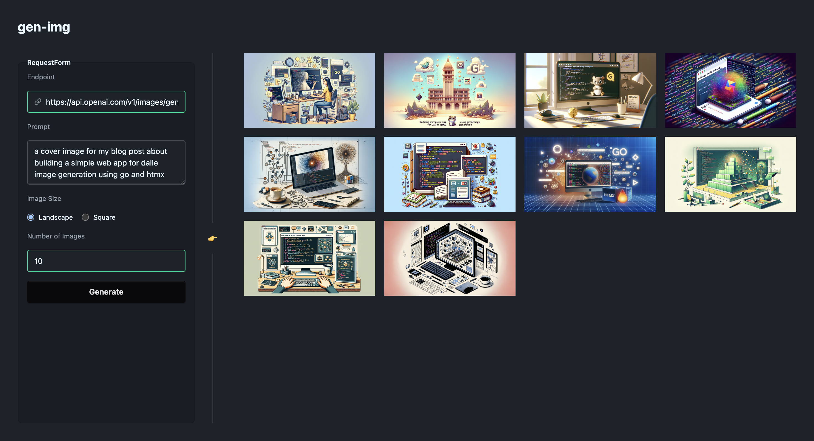

# gen-img: A Single-Page Web App to Generate Images with Dall-E 3

I've been itching to play around with Go and HTMX 🤩, so I figured, why not build a simple web app with them? 
Plus, I've been needing to generate AI images every now and then—like for this blog post's cover image. 
Instead of generating one image at a time and picking through them manually, I thought it'd be way more convenient to build a little app that spits out a bunch of options at once and lets me easily pick the best one.

App screenshot:




## How to Run

1. Clone the repository and go to the project directory:

```bash
git clone https://github.com/Isaac-Fate/gen-img.git
cd gen-img
```

2. Install the dependencies:

```bash
go mod download
```

3. Create a `.env` file and add your OpenAI API key:

```bash
cp .env.example .env
```

Fill in the `.env` file with your OpenAI API key.

4. Run the application:

```bash
go run cmd/web/main.go
```

Since this ptoject uses Gin framework, you may run it in the realse mode setting the `GIN_MODE` environment variable to `release`:

```bash
GIN_MODE=release go run cmd/web/main.go
```

Also, you may also change the default port (8080) by setting the `PORT` environment variable:

```bash
PORT=8081 go run cmd/web/main.go
```

5. Visit `http://localhost:8080` (or the port you set) in your browser.

